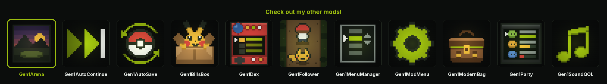
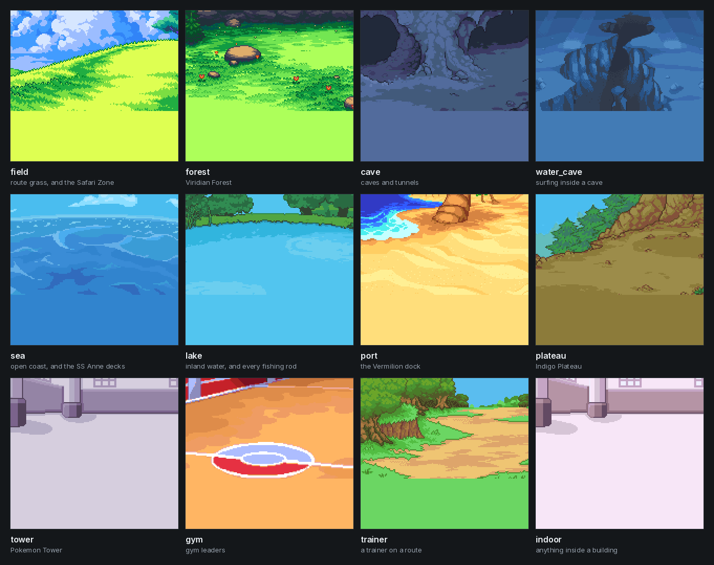
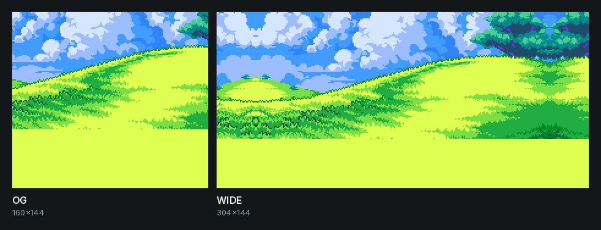
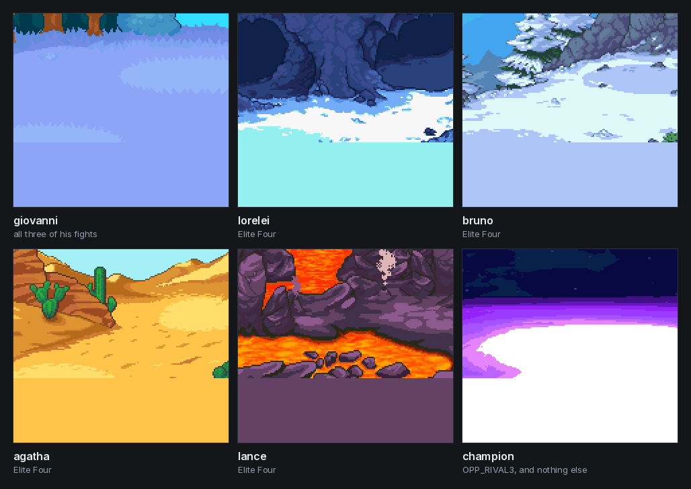
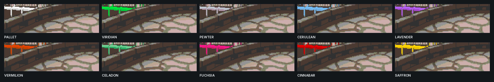
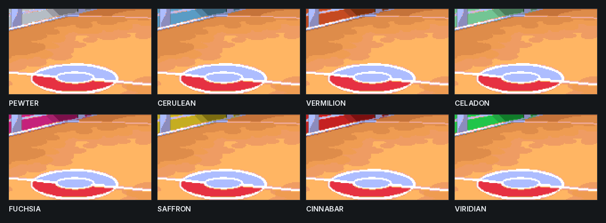

<p align="center">
  <a href="https://wild1walker.github.io/Gen1Wild/"></a>
</p>

<h1 align="center">Gen1Arena</h1>

<p align="center">
  <a href="https://wild1walker.github.io/Gen1Wild/"></a>
</p>

<p align="center">
  <b>2D image backdrops behind Gen1Recomp battles</b><br>
  Selected by map, tileset and encounter kind. Works in both OG (160x144)
  and WIDE (304x144) layouts.
</p>

<p align="center">
  
</p>

<p align="center"><i>Every image on this page is a file out of
<code>assets/backdrops/</code>, scaled by a whole number and otherwise
untouched.</i></p>

By **Wild**.

## Credit -- required

**None of the art in this repository was drawn for this mod.** Every backdrop
under `assets/backdrops/` comes from the **Battle Backgrounds Patch FR** for
Pokemon FireRed. Its authors ask for credit whenever the pack is used, and
that request is the condition this repository ships under:

> **LibertyTwins · princess-phoenix · carchagui · aveontrainer · WesleyFG ·
> kWharever · worldslayer608 · knizz**

If you use, fork or restyle this mod, or lift a single backdrop out of it,
carry those names with it. What this mod adds is the selection logic and three
mechanical passes -- a palette correction, a crop to the engine's two layouts,
and per-town roof recolours. The composition, linework and colour choices in
every scene are theirs. See **[CREDITS.md](CREDITS.md)** for the full
statement.

Only the subset of backdrops the mod actually loads is committed here, not the
whole source pack -- see [What art ships](#what-art-ships).

Note also that Gen1Recomp's mod rules forbid shipping ROM-derived content in a
mod. Some of this pack is original fan art and some is FireRed-derived, and I
can't tell which is which from the files.

Pokemon Red / Blue / FireRed are Nintendo / Creatures / GAME FREAK. This is an
unofficial fan mod with no affiliation or endorsement.

## The two layouts

The engine draws battles at either 160x144 or 304x144, and every backdrop
ships cropped for both.

<p align="center">
  
</p>

## What got mapped

| Slot | Source | FireRed scene |
|---|---|---|
| `default`, `field`, `safari` | 0 Grass | Grass |
| `forest` | 1 Forest | Forest |
| `cave` | 7 Cave | Cave |
| `plateau` | 6 Mountain | Craggy |
| `port` | 2 Beach | Sand |
| `sea`, `deck` | 4 Sea | Sea |
| `lake` | 5 Lake | Pond |
| `water_cave` | 3 Underwater | Underwater |
| `trainer_indoor` | 8 Lab | Indoor Trainer |
| `trainer`, `trainer_field` | 9 Route | Outdoor Trainer |
| `trainer_gym` | 11 Neutral | **Gym Trainer** |
| `gym`, `leader` | 12 Gym | **Gym Leader** |
| `town`, `trainer_town` | 13 Town | **Pokemon Tower** |
| `giovanni` | 14 Snow | Giovanni |
| `lorelei` | 15 Snow Cave | Lorelei |
| `bruno` | 16 Snow Mountain | Bruno |
| `agatha` | 17 Desert | Agatha |
| `lance` | 18 Volcano | Lance |
| `champion` | 19 Space | Champion |
| `indoor`, `museum`, `club`, `mansion`, `ship`, `tower` | 10 Indoors | Trainer Tower |

The right-hand column is what FireRed itself uses each scene for, per
`Backgrounds Table.txt` in the source pack. The patch we took the art from
remaps most of them onto the Gym scene -- gym trainers, and all four Elite
Four. These assignments restore the vanilla split instead, which is what the
art was drawn for.

<p align="center">
  
</p>

Bosses are matched on trainer class, not map, so Giovanni keeps his scene in
all three of his fights (Rocket Hideout, Silph 11F, Viridian Gym). A boss
scene outranks the room, the same way water does -- Agatha's room carries the
CEMETERY tileset and she still gets her own backdrop rather than the tower's.
`OPP_RIVAL3` is the Champion and nothing else; RIVAL1 and RIVAL2 stay on
whatever room they are fought in.

**Unused:** none. All 20 backgrounds have a home.

**`tower` deliberately diverges from FireRed.** Slot 13 is FireRed's Pokemon
Tower scene, but the patch author drew it as an outdoor town view -- a paved
plaza under open sky, for a battle on the fourth floor of a building. The
tower uses the Indoors art instead, under GRAYMON; slot 13 keeps the town
slots it genuinely suits.

Because `place` outranks `kind`, a slot like `trainer` only fires on a tileset
with no art of its own. That is why Route is also registered as
`trainer_field`: wild battles on a route get Grass, trainer battles on the same
route get Route.

`indoor` is the fallback for anything inside a building, so an unmapped
interior tileset gets a room rather than a grass field. Only OVERWORLD,
PLATEAU, SHIP_PORT, FOREST, CAVERN and UNDERGROUND are treated as not-a-
building; everything else lands on `indoor`. The SS Anne interior (SHIP) uses
it too. `port` (Vermilion dock) uses Beach.

### Resolved situations

| Situation | Backdrop |
|---|---|
| wild in route grass | Grass |
| trainer on a route | Route |
| wild or trainer in Viridian Forest | Forest |
| wild or trainer in a cave | Cave |
| trainer in a gym | Gym |
| trainer in a town | Town |
| surfing or fishing on the open coast | Sea |
| surfing or fishing on inland water | Lake |
| surfing or fishing inside a cave | Underwater |
| fishing, anywhere | Lake |
| swimmer trainer | whichever water they are on |
| Snorlax / the birds / Mewtwo | whatever room they are in |
| Safari Zone | Grass |
| SS Anne cabins and corridors | Indoors |
| SS Anne decks (incl. the rival fight) | Sea |
| Vermilion dock | Beach |
| Pokemon Tower | Neutral |
| Rocket Hideout / Silph | Lab |
| Indigo Plateau | Mountain |

### Auditing the whole game

Run the game in developer mode (`POKEPORT_DEV=1`, or `--developer`), turn on
**DIAGNOSTIC** and load a save. (DIAGNOSTIC only logs -- it does not change
what you see. The magenta test field is the separate FIELD TEST row.) At
startup the mod walks **every map** in
`data.maps` and logs what battles it can host and what backdrop it resolves to:

    --- gen1arena audit: N maps ---
        flags: G=grass W=water T=trainers S=static
      CERULEAN_CAVE_1F     CAVERN      GW-S -> cave
      SS_ANNE_BOW          SHIP        --T- -> deck
      OAKS_LAB             LAB         ---- -> lab
    --- no unmapped tilesets, no missing art ---

- `G` / `W` -- rolled grass / water encounters, from `data.encounters`
- `T` -- trainer NPCs, map objects carrying `trainerClass`
- `S` -- static wild encounters, objects carrying `pokemon` (Snorlax, the
  birds, Mewtwo, the Vermilion Machop)

Every map is listed, not just ones with those flags, because a map can host a
battle with none of them: the rival in Oak's Lab, Oak in Pallet Town and the
Chief in Celadon are script `start_battle` rows with no trainer object behind
them. Those are exactly the maps an encounter-driven audit would miss.

Each row is also checked against the art on disk, so a slot that resolves but
has no PNG is flagged `NO ART FOR SLOT` rather than silently falling back.

### Where the audit goes

The engine's Logger only `print`s and keeps the last 200 lines, and Kanto has
more maps than that -- so the full table would scroll itself away, and on iOS
stdout is nowhere you can reach anyway. Instead:

- **Full table** -> a file, written through mod storage:
  `mod_storage/<gameVersion>/<playthroughId>/gen1arena/audit.bin`
  under the LOVE save directory for identity `pokemon-love2d`:
  - Windows: `%APPDATA%\LOVE\pokemon-love2d\`
  - macOS: `~/Library/Application Support/LOVE/pokemon-love2d/`
  - Linux: `~/.local/share/love/pokemon-love2d/`

  Despite the `.bin` extension it is plain text -- that suffix is just how mod
  storage tags opaque values. Open it in any editor.

- **Problems only** -> the log. Unmapped tilesets and missing art always fit
  well inside 200 lines, so if the audit is clean you will see one line saying
  so.

Storage needs an identified playthrough, so load a save first; running the
audit from the title screen will report `not_in_playthrough`.

`audit.bin` is the artefact to attach when reporting a gap.

## Town recolours

Taken from the engine's own overworld colouring, not invented.
`world.roofByMapIndex` in `data/palettes_gbc.lua` is indexed by map index
(the eleven city maps, 0..10) and holds exactly two colours per town -- a roof
light and a roof dark:

    0 Pallet     white / grey        6 Celadon    mint / green
    1 Viridian   green               7 Fuchsia    magenta / rose
    2 Pewter     blue-grey stone     8 Cinnabar   red
    3 Cerulean   sky blue            9 Indigo     violet
    4 Lavender   purple             10 Saffron    yellow / gold
    5 Vermilion  orange

That is the entire difference between one Kanto town and the next in the GBC
overworld: **the roofs change and nothing else does.** Grass stays green,
water stays blue, paths and stone stay as they are. So that is what these
recolours do. Earlier attempts at a full-scene tint were inventing a
difference the game does not have.

<p align="center">
  <br>
  <i>The same plaza in all ten towns, cropped to the roofline.</i>
</p>

- **Town maps** -- the art's two roof browns are remapped onto that town's
  roof pair by luminance. The mask is hue+saturation: the only saturated warm
  colours in the town art are the roofs (hue 20/28, sat ~0.7), while tree
  green (146) and water blue (195/228) are far outside it and every
  structural colour sits below 0.35 saturation.
<p align="center">
  <br>
  <i>Walls rotate to the town's hue. The floor, the court lines and the Poke
  Ball are byte-identical in every one.</i>
</p>

- **Gyms** -- walls only, rotated to the town's roof hue. The floor, court
  lines and Poke Ball are byte-identical in every gym, so the ball reads as
  the same ball everywhere. The gym mask is by **hue**, not position: the
  wall's bottom edge is diagonal, so a positional mask cut a hard band across
  the floor. Wall planks sit at hue 324-360/0-5 and the floor's orange at
  24-31. The `y<62` guard exists for one reason only -- the Poke Ball's red is
  the same red as the wall.
- **Interiors are untouched.** A Pokemon Center looks the same in every city.

**Gym leaders take their town's colour**; Giovanni, the Elite Four and the
Champion keep their own scenes.

Regenerate with `recolor.py`.

## The Pokemon Tower

`FieldDefaults` routes the tower by **tileset**, not by map:
`byTileset = { CEMETERY = "GRAYMON" }`. So it does not wear Lavender's palette
at all -- it wears GRAYMON, and every CEMETERY map gets it. That makes it a
change to the base `tower` slot rather than a per-town variant.

GRAYMON is `white / (214,132,181) / (123,107,148) / black`. Used whole it comes
out **pink**: its midtone is a dusty rose and most of the art's luminance lands
on it. Only the third stop -- the grey-violet -- gives the drained look the
name promises, so that is the one used, at 0.80 strength with a 0.85 dusk.

**This is an interpretation of the palette, not a transcription.** The game
applies all four stops. Picking one out of four is a judgement call.

**Base art:** `10 Indoors`, not slot 13. The tower is an interior and slot 13
is an outdoor plaza with sky. Under GRAYMON the Indoors art reads as a
pillared hall, which is what the room is. The cost is that the tower and every
Pokemon Center share one image, separated only by the GRAYMON pass -- visible
in `tower_final.png`, and a fair trade.

## Per-map overrides

A few maps are the wrong shape for their tileset. The S.S. Anne's open decks
carry the SHIP tileset along with the cabins, so a tileset-only rule stands you
in a panelled room while you are outside on the sea. `MAP_SLOT` in `main.lua`
is checked before the tileset and fixes those by map id:

    SS_ANNE_BOW          -> deck      foredeck, and the rival fight
    SS_ANNE_3F           -> deck      top-deck walkway
    VERMILION_DOCK       -> port
    OAKS_LAB             -> indoor    carries the DOJO tileset
    CINNABAR_GYM         -> gym       carries FACILITY
    SAFFRON_GYM          -> gym       carries FACILITY
    SILPH_CO_11F         -> indoor    carries INTERIOR
    CELADON_MART_ROOF    -> town      open air on an interior tileset
    CELADON_MANSION_ROOF -> town      same

Every one of these was found by running the audit against the real map data,
not guessed. `OAKS_LAB` mattered most: it uses the DOJO tileset, so the rival
fight that opens the game was resolving to a gym. Blaine and Sabrina were
showing Silph Co.'s interior because their gyms carry FACILITY.

Two SHIP-tileset maps are not ships at all -- `CERULEAN_BADGE_HOUSE` and
`FUCHSIA_GOOD_ROD_HOUSE` -- which is harmless only because `ship` uses the
Indoors art. It would have broken if `ship` were the sea, which is the
version of this that shipped in 0.2.1.

`SS_ANNE_STERN` does not exist; that was a guess of mine, now removed.

### Water

Which water you are on, not what you are doing on it -- so surfing and fishing
the same water get the same backdrop, and fishing from a boat no longer shows
a lake on the open ocean.

    open coast   -> Sea
    inland       -> Lake
    inside a cave -> Underwater

Water outranks a town's recolour as well as the tileset. The eleven city maps
carry OVERWORLD and resolve to `town`, so until 0.18.1 surfing off Cinnabar or
fishing at Vermilion came up against the town's rooftops -- the town variant
answered before the water rule was reached.

The cave case comes first: Seafoam and Cerulean Cave have no sky, and the Sea
backdrop is mostly sky.

## Lookup order

Wild battle in a cave: `wild_cave` -> `cave` -> `wild` -> `default`.

Kinds: `wild`, `trainer`, `safari`, `link`.
Places: `field`, `plateau`, `forest`, `cave`, `tower`, `mansion`, `gym`,
`club`, `facility`, `ship`, `lab`, `museum`, `indoor`.

## Palette correction

The FireRed art is authored for a GBA and reads washed out next to ADVANCED's
GBC sprites. Measured over every pixel of all 20 backgrounds against the 446
colours in `data/palettes_gbc.lua`:

| | mean saturation | mean value |
|---|---|---|
| FR pack, as shipped | 0.372 | 0.713 |
| ADVANCED (pokered-gbc) | 0.674 | 0.771 |

So the gap is chroma, not brightness -- a brightness/contrast tweak would not
have fixed it. `palettize.py` applies a per-image saturation power curve fitted
so each image lands on its own target, then quantises every channel onto the
GBC's 5-bit ladder. Working on the palette rather than the pixels keeps the
flat pixel-art blocking intact.

Two things it deliberately does NOT do:

- **It does not push everything to one saturation number.** Grey interiors
  (Indoors, Lab) get a gentle washout fix capped well below the mean; a lab
  wall is supposed to be grey.
- **It does not snap to the nearest SuperPalette colour.** That was tried
  first and was wrong: nearest-neighbour in CIELAB does not preserve luminance
  ORDER, so Cave's mid-dark rock was pulled up while its darkest shade was
  pulled to pure black, drawing hard rims round the cave mouths. Quantising is
  monotonic per channel and cannot do that.

Dark scenes (Cave, Volcano) get a reduced chroma boost and a value lift, since
pushing them further made them darker -- the direction that turns a Gen 1 back
sprite into a silhouette.

Re-run: `python3 palettize.py <FR Resources> corrected/` then
`python3 convert.py corrected/ assets/backdrops/`.

## Geometry

Sizes are read from engine source, not guessed:

- `og/*.png` -- **160x144**, battlefield is the top **96** rows
  (`drawClassic` scissors mon pics to `y < 96`)
- `wide/*.png` -- **304x144**, battlefield is the top **104** rows
  (`WideBattle.FIELD_BOTTOM = 104`)

Rows below the battlefield sit under an opaque message window and are filled
flat. Nothing is resampled -- a backdrop pixel is exactly one sprite pixel. The
price is cropping: the source art is a 240x112 GBA field, so OG shows its
middle 160 columns, and WIDE mirror-pads 32 columns onto each side. The mirror
seam is visible on `default`/`field` where a tree sits near the right edge.

To re-cut with different crops, edit `convert.py` and re-run.

## Indoors is indoors

FireRed picks a scene by terrain, and inside a building that means: a **wild**
battle gets the generic Indoors scene, a **trainer** battle gets the Indoor
Trainer scene. The FACILITY, LAB, INTERIOR, HOUSE, MART, POKECENTER, LOBBY,
GATE and FOREST_GATE tilesets all now resolve to one `indoor` place, and the
split falls out of the lookup for free because `trainer_indoor` outranks
`indoor`.

That retired the separate `lab` and `facility` slots. They were showing the
Indoor Trainer scene to wild encounters in Pokemon Mansion and the Power
Plant -- the only two buildings in Kanto with wild battles, so the only two
places the mistake was visible.

## Still open

- **The sea/inland split is hand-classified.** Nothing in the map data
  distinguishes a sea tile from a pond tile, so `OCEAN_MAP` in `main.lua` is a
  hand-classified list from Kanto's geography: Pallet, Vermilion and its dock,
  Cinnabar, Fuchsia, and Routes 12, 13, 19, 20 and 21. Everything else is
  inland. If a route looks wrong, it is one line.
- **Underwater art is unused.** Gen 1 has no Dive; the engine rolls exactly
  three terrains (grass, water, indoor) plus fishing pools. There is nowhere
  to put it.
- **Back-sprite contrast** -- fixed in 0.19.0 by **MON PAPER**, on by default.
  Gen 1 pics are matted: the extractor floods colour 0 in from the edge of the
  pic and turns it transparent, and because the flood stops only at ink it
  pours through any gap in a mon's outline and hollows out the body behind it.
  Against the white field that is invisible; against a backdrop it is a window,
  and a pale mon -- Mew's back pic keeps 145 of the 400 pixels in its own
  bounding box -- reads as a bare outline with the scenery showing through.
  MON PAPER fills the pic's own content box with the field shade before the
  engine draws it, which is the composition the Game Boy showed. Only pics that
  actually lost something get it: four-shade art with more than 30% of its
  content box transparent. A sprite mod's true-colour replacement carries its
  own alpha and is left alone, so a Crystal front and a vanilla back in the
  same battle are each treated correctly.
- **Palette modes.** Backdrops bypass the palette bake, so they do not shift
  with COLORS. In OG / OG INV / CLASSIC you get full-colour GBA art behind
  four-shade sprites. Check it in ADVANCED first.
- **White flashes.** Battle intro wipes and the hit-flash overlay still paint
  white, now over a backdrop instead of a white field.

## What art ships

The sheets on this page are redrawn from the committed art by

```sh
python3 tools/make_showcase.py          # every sheet
python3 tools/make_showcase.py towns    # ... or just the ones named
```

It needs `Pillow`, and fetches its label font from Google Fonts once into
`tools/.cache/`, which is not committed. Nothing in a sheet is drawn,
composited or touched up -- each tile is a crop of a file under
`assets/backdrops/` at a whole-number scale.


`assets/backdrops/` holds only the images the mod can actually load, not the
whole generated set and not the source pack. Two layouts, `og/` and `wide/`,
each carrying:

- **the 31 base slots** at the top level -- the slot table above, one PNG each
- **`<town>/town.png`** for the ten town maps: Pallet, Viridian, Pewter,
  Cerulean, Vermilion, Celadon, Fuchsia, Cinnabar, Saffron and Lavender
- **`<town>/gym.png`** and **`<town>/trainer_gym.png`** for the eight towns
  with a gym -- everywhere except Pallet and Lavender, which have none
- **`indigo/plateau.png`**, the only map Indigo owns

Everything else `recolor.py` emits is dropped, because the lookup in
`pickBackdrop` can never reach it and the file is byte-identical to the one it
would fall back to:

| Dropped | Falls back to | Same image? |
|---|---|---|
| `<town>/trainer_town.png` | `<town>/town.png` | yes -- the town pass does not treat them differently |
| `<town>/leader.png` | `<town>/gym.png` | yes -- `leader_gym` is never a filename, so the leader lands on the gym art either way |
| `<town>/plateau.png` (all but Indigo) | -- | unreachable; no other town has a PLATEAU map |
| `<town>/gym.png`, `trainer_gym.png` for Pallet, Lavender, Indigo | -- | unreachable; those three have no gym |
| `<town>/tower.png` | root `tower.png` | **no, and that is the point.** The tower wears GRAYMON by tileset, not a town's roofs. Older builds emitted a Lavender-tinted `tower.png` that shadowed it; `recolor.py` no longer generates one |

Re-running `recolor.py` will put the dropped files back. They are harmless --
they resolve to the same picture -- but they do not need committing. The one
exception is `<town>/tower.png`: the current `recolor.py` does not emit it, and
it should not come back.

## Install

Import `gen1arena-0.18.1.zip` via MODS -> Import mod .zip.
Toggle with the mod's **BACKDROPS** option row.

Two option rows:

- **BACKDROPS** -- on/off
- **MON PAPER** -- lay the field shade back under a pic the matte hollowed
  out, so a pale mon is not a window onto the backdrop. Off leaves the pic
  exactly as the engine hands it over

and two more in developer mode only (`POKEPORT_DEV=1`, or `--developer`,
which the engine resolves once and hands each mod as `mod.developer`):

- **DIAGNOSTIC** -- logging and the startup audit; changes nothing on screen
- **FIELD TEST** -- paints the battlefield flat magenta instead of the
  backdrop, to tell "patch never ran" apart from "patch ran, image lost"

Those two are maintenance tools rather than settings, and the second is a trap
on a shipped cart: the row does not say what it does, and finding out leaves
every battle magenta until you find the row again. Outside developer mode they
are not offered and not read, so a value left set in an older install cannot
strand anyone.

## If it is still white

Run the game in developer mode (`POKEPORT_DEV=1`, or `--developer`) so the row
is offered, turn on the mod's **FIELD TEST** row and start a battle:

- **Magenta field** -- the patch is running and the backdrop is being lost
  downstream (palette pass or canvas ordering). Tell me which layout and
  which COLORS mode.
- **Wrong background everywhere** -- DIAGNOSTIC also logs each tileset the
  first time a battle starts on it, as `tileset SHIP -> ship`. An
  `(unmapped, using default)` line means that tileset needs a row in
  `TILESET_SLOT`.
- **Still white** -- the patch never fired. Check the log for
  `[gen1arena] patched battle draw`; its absence is the signal.
